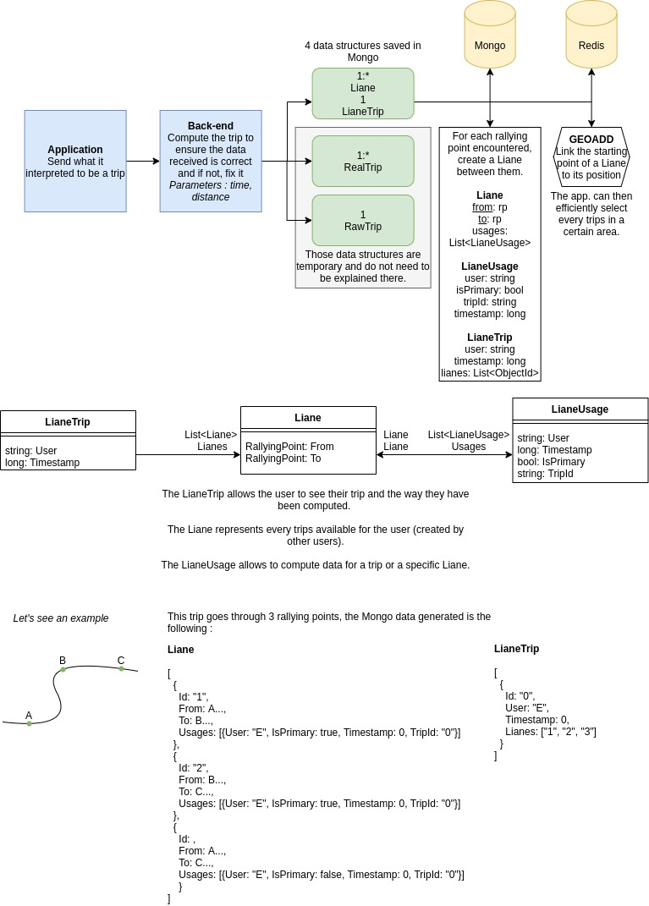

# Liane back-end documentation

## Overall architecture

The project is built on dotnet core 5 in C#.

- `Liane.Api` : services interface ;
- `Liane.Service` : services implementation ;
- `Liane.Web` : controllers and services instantiation ;
- `Liane.Test` : unit testing classes ;

## Trip management

The following diagram explains the architecture.


```
classDiagram
    class LianeUsage {
        +string User
        +long TimeStamp
        +bool IsPrimary
        +string TripId
    }
    class Liane {
        +RallyingPoint From
        +RallyingPoint To
    }
    class LianeTrip {
        +string User
        +long TimeStamp
    }

    LianeUsage <-- Liane : List<LianeUsage> LianeUsages
    LianeTrip --> Liane : List<Liane> Lianes
    LianeUsage --> Liane : Liane Liane
    
```




This architecture answer the need for 4 requests :

- Get all trips of a specific user ;
- Allow the user to delete a trip ;
- Get all trips in a specific area and depending on various criteria ;
- Allow and administrator to re-generate the trips ;

## Databases

This project uses two databases systems : Mongo and Redis. 

In order to launch the databases, it is necessary to install docker. 
Then, you can use the following commands to manage the database.

#### Launch and stop databases

In order to launch and init the databases Mongo and Redis, you can use the command :

```bash
./liane init
```

If you want to stop the databases, use the following commands : 

```bash
./liane stop
```

## Twilio configuration

To use Twilio (the service to send messages), you need to define three environment variables :

```bash
export LIANE_TWILIO__ACCOUNT=XXX
export LIANE_TWILIO__FROM=+000
export LIANE_TWILIO__TOKEN=xxx
```

## Launch the project

Dotnet is mandatory in order to launch the backend part of the project. To 
get information about dotnet go [here](https://dotnet.microsoft.com).

* On MacOS, you can install it using brew : `brew install homebrew/cask/dotnet` ;
* On Ubuntu (whether it is WSL or not), you can get detailed instructions [here](https://docs.microsoft.com/fr-fr/dotnet/core/install/linux-ubuntu).

Once dotnet is installed, you can launch the project using : 

```bash
./liane start
```

You can then open http://localhost:8081/swagger which displays
the documentation of each endpoint.
